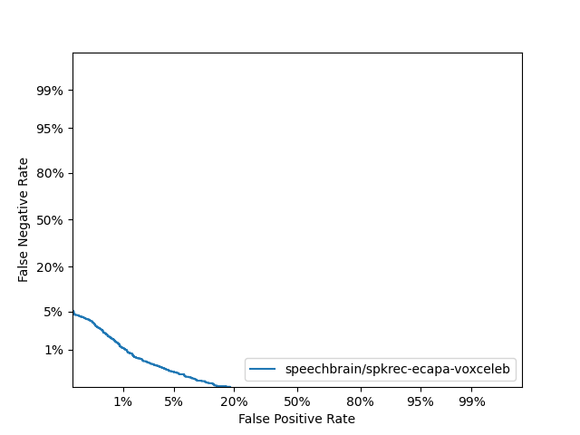

# Speaker Verification

> The goal of this project is to create a neural network capable of encoding the speaker's identity into 
an embedding vector, which can be used for speaker verification. Many loss functions can be used (e.g. triplet loss 
[torch.nn.TripletMarginLoss](https://pytorch.org/docs/stable/generated/torch.nn.TripletMarginLoss.html),
Angular Softmax Loss).

## Development setup

To create a virtual environment with all the necessary dependencies, run `make venv`. To use it,
run `source venv/bin/activate`.

For other helpful targets (such as formatting, launching scripts, ...), see [Makefile](Makefile).

## Dataset

For training and evaluation, we are using the VoxCeleb dataset. This dataset takes around 30GB and can be downloaded
using `make download-voxceleb` target. This will save the dataset into `voxceleb1` directory relative
to project root (the path can be changed by setting `KNN_DATASET_DIR` environment variable).

On Metacentrum, I have pre-downloaded this dataset into my home directory at
`/storage/brno12-cerit/home/tichavskym/voxceleb1`.

## ECAPA-TDNN training

To train the custom version of ECAPA-TDNN, execute `make train`. You can use environment variables to parametrize
the job run, namely

- `KNN_DATASET_DIR` with path pointing to the Voxceleb1 dataset,
- `KNN_MODEL` which model to train (either "ECAPA", "WAVLM_ECAPA", "WAVLM_ECAPA_WEIGHTED", or 
    "WAVLM_ECAPA_WEIGHTED_UNFIXED")
- `MODEL_IN_DIR` should be set only if you want to start training from a saved checkpoint, this expects
    `ecapa_tdnn.state_dict`, `classifier.state_dict` and `optimizer.state_dict` files to be present in the given
    directory.
- `KNN_MODEL_OUT_DIR` where the model, classifier and optimizer checkpoints are stored ater each iteration
- `KNN_DEBUG` to mark if you're executing in debug mode,
- `NOF_EPOCHS` for how many epoch you want to train your model,
- `KNN_BATCH_SIZE` to set mini-batch size,
- `KNN_VIEW_STEP` to set after how many iteration to print the stats

Output of the training is stored in `experiments/` directory by default.

## Model evaluation

Model evaluation can be executed using `make evaluate` target. This will launches [evaluate.py](evaluate.py) script,
which evaluates the model on the VoxCeleb test set. This script can be parametrized using environment variables, namely

- `KNN_MODEL` to choose which model to evaluate, either `microsoft/wavlm-base-sv`, `speechbrain/spkrec-ecapa-voxceleb`,
    or `ecapa-tdnn`,
- `KNN_MODEL_FILENAME` if `KNN_MODEL` is set to `ecapa-tdnn`, this variable contains the path to the model file with
    weights and biases. This file should be in a `state_dict` format,
- `KNN_DATASET_DIR` with path pointing to the Voxceleb1 dataset,
- `EVAL_FIRST` when debugging, this variable can be set to number of samples to evaluate (when unset,
    evaluates on the whole verification set).

The script will create two files in `experimets/{scores, det}` with scores for each pair of recordings and DET 
curve for the model. It will also print the EER (Equal Error Rate) value to stdout.

If you want to evaluate (or perform any other computation) on Metacentrum infrastructure, check out scripts 
in [metacentrum/](metacentrum/) directory.

### Results

| Model                             | EER    | minDCF   |
|-----------------------------------|--------|----------|
| speechbrain/spkrec-ecapa-voxceleb | 1.04 % | 0.0036 * |

`*`: this might be wrong, as I'd expect numbers around 0.06

#### DET curve:

## Acknowledgements

Computational resources were provided by the e-INFRA CZ project (ID:90254),
supported by the Ministry of Education, Youth and Sports of the Czech Republic.
